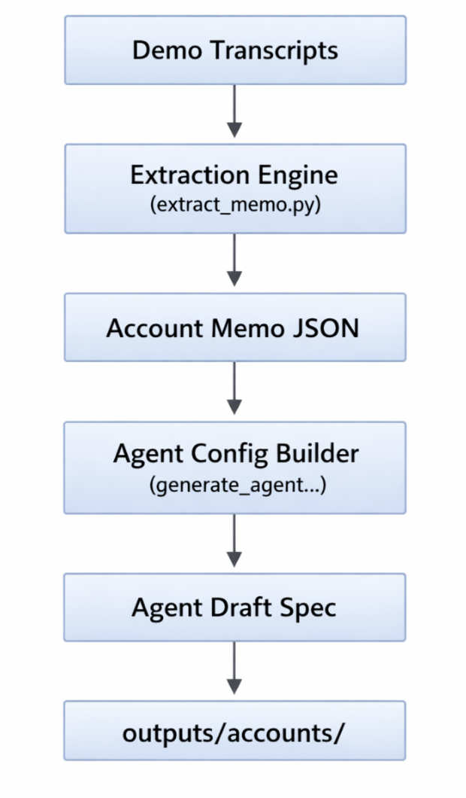

# Clara AI Automation Pipeline

This project implements a zero-cost automation pipeline that converts demo call transcripts into a preliminary Retell AI receptionist configuration and updates it when onboarding changes occur.

The system processes demo calls to generate an initial agent configuration (v1) and later processes onboarding updates to produce a revised configuration (v2) with a clear change log.

The pipeline runs locally using rule-based extraction and JSON storage, ensuring the entire workflow operates without any paid APIs or services.

## Project Goal

The goal of this project is to automatically convert call transcripts into a structured configuration for a voice AI receptionist.

The system performs two main tasks:

### Pipeline A — Demo Call → Agent v1

1. Read a demo call transcript.
2. Extract structured business information.
3. Generate an **Account Memo JSON**.
4. Generate a **Retell Agent Draft Specification**.
5. Store the results as version **v1**.

### Pipeline B — Onboarding Call → Agent v2

1. Read an onboarding update transcript.
2. Extract updated business information.
3. Compare with the existing memo.
4. Generate an updated **v2 memo**.
5. Generate an updated **agent configuration**.
6. Produce a **change log** showing what changed.

## System Architecture

The pipeline processes transcripts and converts them into structured agent configurations.
<p align="center">
  
</p>

## Project Structure

CLARA-AUTOMATION<br>
│<br>
├── dataset<br>
│   Demo call transcripts and onboarding update transcripts<br>
│<br>
├── scripts<br>
│   Python scripts that implement the automation pipeline<br>
│<br>
│   extract_memo.py<br>
│       Extracts structured business information from transcripts<br>
│<br>
│   update_memo.py<br>
│       Updates the existing memo when onboarding changes occur<br>
│<br>
│   generate_agent_config.py<br>
│       Generates the Retell agent configuration from the memo<br>
│<br>
│   run_pipeline.py<br>
│       Main orchestrator that runs the full pipeline<br>
│<br>
├── outputs/accounts<br>
│   Stores generated agent configurations and memo versions<br>
│<br>
│   v1<br>
│       Initial configuration generated from demo transcript<br>
│<br>
│   v2<br>
│       Updated configuration generated after onboarding update<br>
│<br>
├── workflows<br>
│   Documentation describing how automation can be orchestrated<br>
│<br>
└── README.md<br>
    Project documentation<br>

## How to Run the Pipeline

Follow these steps to run the automation pipeline locally.

### 1. Clone the Repository

```bash
git clone <repository-url>
cd clara-automation
```

## Add Call Transcripts

Place demo and onboarding transcripts inside the dataset folder.

Example:

dataset/
    demo_001.txt    
    onboarding_001.txt

## Run the Automation Pipeline


# Run the pipeline script:

**python scripts/run_pipeline.py**

The pipeline will automatically:

1.Process demo transcripts
2.Generate Account Memo v1
3.Generate Agent Draft Spec v1
4.Process onboarding updates
5.Generate Memo v2
6.Generate updated Agent Draft Spec
7.Produce a change log

## Output Structure

The pipeline stores generated artifacts inside the `outputs/accounts` directory.

Each account has its own folder containing versioned configurations.

Example structure:


outputs/accounts/<accounts>/

v1/
memo.json
agent_draft_spec.json

v2/
memo.json
agent_draft_spec.json

changes.json


### Explanation

**memo.json**

Contains the structured business configuration extracted from transcripts.

Includes information such as:

- company name
- business hours
- supported services
- emergency definitions
- routing rules
- call transfer rules

**agent_draft_spec.json**

Contains the generated AI receptionist configuration including:

- system prompt
- greeting message
- routing logic
- supported services
- emergency conditions

**changes.json**

Tracks differences between **v1 and v2** configurations to clearly show what changed during onboarding updates.

## Retell Setup Instructions

The system generates a **Retell Agent Draft Specification** which can be used to configure a voice AI receptionist.

### 1. Create a Retell Account

Sign up at:

https://www.retellai.com

Create a new AI agent inside the Retell dashboard.

---

### 2. Using the Generated Agent Draft Spec

The pipeline generates a file:


agent_draft_spec.json


This file contains the configuration for the AI receptionist including:

- greeting message<br>
- system prompt<br>
- routing rules<br>
- supported services<br>
- emergency handling behavior<br>

---

### 3. If API Access Is Available

If the Retell API is available, the agent configuration can be created programmatically using the Retell API.

Example workflow:


Generated Agent Spec
↓
Retell API Request
↓
Agent Created Automatically


---

### 4. Manual Setup (Free Tier)

If API access is not available on the free tier, the generated system prompt can be copied into the Retell dashboard manually.

Steps:

1. Open the generated `agent_draft_spec.json`
2. Copy the **system_prompt**
3. Paste it into the Retell agent configuration interface
4. Configure the greeting and call handling settings using the generated values

This allows the agent configuration to be recreated without direct API access.

## Automation Design

The pipeline is designed to run automatically when new call transcripts are received.

### Example Automation Flow


New Transcript Received
↓
Automation Trigger
↓
Run Pipeline Script
↓
Extract Account Memo
↓
Generate Agent Draft Spec
↓
Store Outputs


### Automation Orchestrator Options

The workflow can be automated using orchestration tools such as:

- **n8n** (recommended for local automation)
- **Make**
- **Zapier**

Example n8n workflow:


File Trigger (new transcript detected)
↓
Execute Command
↓
python scripts/run_pipeline.py
↓
Outputs generated automatically


### Current Implementation

The current system uses a **Python orchestrator script**:


scripts/run_pipeline.py


This script processes transcripts and executes the full pipeline automatically.

### Storage

All generated artifacts are stored locally as structured JSON files:


outputs/accounts/


This approach ensures:

- zero infrastructure cost
- simple version tracking
- easy reproducibility